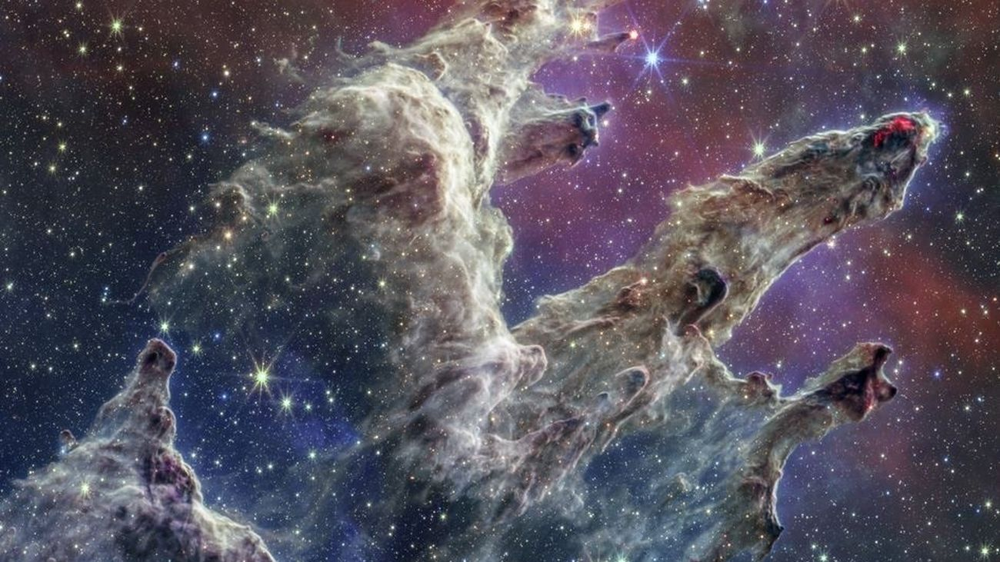

# Formación del Sistema Solar

El sistema solar se formó hace aproximadamente **4.6 mil millones de años** a partir de una nube molecular gigante.

> Imagen: representación artística de una nebulosa protosolar.

Durante millones de años, la gravedad fue atrayendo el polvo y gas hacia un centro denso que dio origen al **Sol**, mientras que los materiales sobrantes se agruparon en planetas y lunas.
